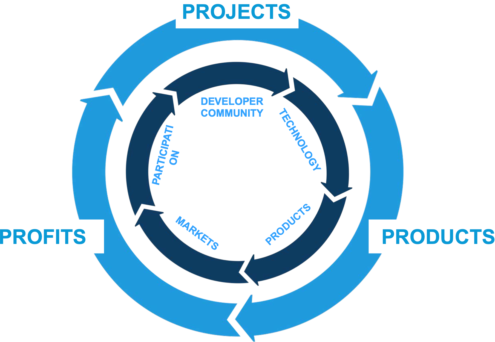

# Bringing a Call for Code project to the Linux Foundation

 

This repository contains details on what is needed for [Call for Code](https://developer.ibm.com/callforcode/) projects to join the [Linux Foundation under the Call for Code umbrella](https://www.linuxfoundation.org/projects/call-for-code/).

## Why host your project at the Linux Foundation

- The LF provides a neutral home for the open source code that can power many business models on top
- The project legal structure provides a way for many participants to improve the underlying technology
- The LF has many avenues to access developers, funding, mentorship, events, and marketing
- Successful projects depend on an ecosystem to develop solutions that the market will adopt. Adoption drives sustainability.
- [Learn more in this detailed presentation](Why-Host-a-Project-at-the-Linux-Foundation.pdf).

  

## Beginning your journey with the Linux Foundation

Once we have worked out the [intended mission and scope of the sponsored project, we work to build out a formation group to draft the governance documents and finalize the project structure](CFC-LF-Technical-Charter-Sample.pdf) as a community.

Towards the end of the formation process we often convene a marketing team, and the LF will prepare the launch press release with input and feedback from the marketing team.

In addition to increased efficiency, working in formation teams allows for the community to begin collaborating before the project even formally launches.

## Preparing to open source a project with the Linux Foundation

### Ecosystem and documents

- [ ] Prepare mission and scope statement for the [Linux Foundation Technical Charter](CFC-LF-Technical-Charter-Sample.pdf)
- [ ] Analyze code for license consistency with [Apache 2 LICENSE](http://www.apache.org/licenses/LICENSE-2.0) or other as needed
- [ ] Assess ecosystem of launch partners who would be part of the announcement (Ideally at least 1)
- [ ] Choose new name or hand over [existing names and trademarks](CFC-LF-Trademark-Assignment-Sample.pdf)
- [ ] Identify marketing, content, communications or other needs for the project (including from IBM)
- [ ] Prep content for developers to take part in the project on day one
- [ ] Choose Technical Steering Committee members
- [ ] Prepare Slack channel or workspace for contributors
- [ ] Evaluate [LFX](https://lfx.linuxfoundation.org/) options for marketing, community, funding

### GitHub and source code updates

- [ ] Add the [Apache 2 LICENSE](http://www.apache.org/licenses/LICENSE-2.0#apply) to your GitHub repository and include the specific copyright header to your source code files using the relevant comment syntax for the programming language. Add the license file as is, then use the current year and list the names of your team members in your individual source files.
- [ ] Look at improving your documentation so that first time visitors clearly see the problem you are solving and how they can understand the solution in your README.md. Also consider enabling alternative language translations.
- [ ] Look at carefully documenting installation/duplication steps so that new developers can explore the technology on their own systems in order to contribute back fixes. This will also help you identify any potential dependency issues you might have on clean installations.
- [ ] Add a basic [CONTRIBUTING.md](https://github.com/nodejs/node/blob/master/CONTRIBUTING.md) that describes how others can start to collaborating with you. The Linux Foundation has a few sample files you can use for inspiration. The way you choose to accept fixes is up to you though.
- [ ] Strongly consider adding the [Developer Certificate of Origin](https://github.com/apps/dco) bot to your repositories. This provides assurance that anyone who contributes to your repository has the rights to the code they want to provide.
- [ ] Consider configuring GitHub pages to create a basic description and FAQ site, like [gql.foundation](https://gql.foundation/)

## Examples

### Project OWL

- Won the Call for Code Global Challenge in October 2018
- Executed an [IBM Service Corps deployment, incubation, and field tests](https://developer.ibm.com/callforcode/solutions/owl/) in 2019
- Created new [ClusterDuck Protocol name and project at LF](https://www.linuxfoundation.org/press-release/the-linux-foundation-open-sources-hardware-of-disaster-relief-project-that-won-first-call-for-code-global-challenge-led-by-ibm/) in March 2020
- The [Project OWL](https://www.project-owl.com/) name continues to be used for the successful startup
- The ClusterDuck Protocol has its own [open source repo](https://github.com/Call-for-Code/ClusterDuck-Protocol) and [web site](https://clusterduckprotocol.org/)

### Prometeo

- Won the Call for Code Global Challenge in October 2019
- Executed an [IBM Service Corps deployment, incubation, field tests](https://developer.ibm.com/callforcode/solutions/prometeo/) in 2020
- Created new [Pyrrha name and project at LF](https://www.linuxfoundation.org/press-release/the-linux-foundation-prometeo-ibm-and-partners-announce-new-firefighter-safety-open-source-project/) in July 2021
- The [Prometeo](https://prometeoplatform.com/THOROUGHLY.htm) name continues to be used for the successful startup
- The [Pyrrha project has its own open source organization](https://github.com/Pyrrha-Platform) and [web site](https://pyrrha-platform.org/)

### Build Change

- Runner up in Call for Code Global Challenge in October 2018
- Created a [new project named ISAC-SIMO, based on PD3R](https://developer.ibm.com/callforcode/solutions/build-change/), in 2020
- Brought [the ISAC-SIMO project and name to the LF](https://linuxfoundation.org/press-release/new-open-source-project-uses-machine-learning-to-inform-quality-assurance-for-construction-in-emerging-nations/) in July 2021
- The [Build Change](https://buildchange.org/) name was used before and after for the non-profit organization
- The [ISAC-SIMO project has its own open source organization](https://github.com/ISAC-SIMO) and [web site](https://isac-simo.net/)

### Liquid Prep

- Won the IBMer Call for Code Global Challenge in October 2019
- Executed an IBM Service Corps deployment, incubation, field tests in 2020
- Transferred [the Liquid Prep trademark to the LF](https://linuxfoundation.org/blog/liquid-prep-intelligent-watering-solution-now-hosted-by-the-linux-foundation-as-a-call-for-code-project/) in March 2021
- The [Liquid Prep community](https://github.com/Liquid-Prep), not a separate legal entity, manages the project

### Grillo

- Joined the Code and Response community in February 2020
- Created a [new project named OpenEEW](https://developer.ibm.com/tutorials/build-an-openeew-earthquake-early-warning-node-red-dashboard/), in 2020
- Brought [the OpenEEW project and name to the LF](https://www.linuxfoundation.org/press-release/the-linux-foundation-grillo-and-ibm-announce-new-earthquake-early-warning-open-source-project/) in August 2020
- The [Grillo](https://grillo.io/) name was used before and after for the startup
- The [OpenEEW project has its own open source organization](https://github.com/openeew) and [web site](https://openeew.com/)

### Agrolly

- Won the IBMer Call for Code Global Challenge in October 2020
- Created a new project named OpenTempus, in 2022
- Brought [the OpenTempus project and name to the LF](https://www.linuxfoundation.org/blog/two-new-agricultural-technology-projects-join-the-call-for-code-community-at-the-linux-foundation) in December 2022
- The [OpenTempus project has its own open source organization](https://github.com/OpenTempus) and [web site](https://opentempus.com/)

## Resources

- [Call for Code and the Linux Foundation](Bringing-Call-for-Code-Projects-to-The-Linux-Foundation-Briefing.pdf)
- [Call for Code Graduation](CFC-Deployment-Graduation-External.pdf)
- [Linux Foundation Technical Charter template](CFC-LF-Technical-Charter-Sample.pdf)
- [Linux Foundation Trademark Assignment template](CFC-LF-Trademark-Assignment-Sample.pdf)
